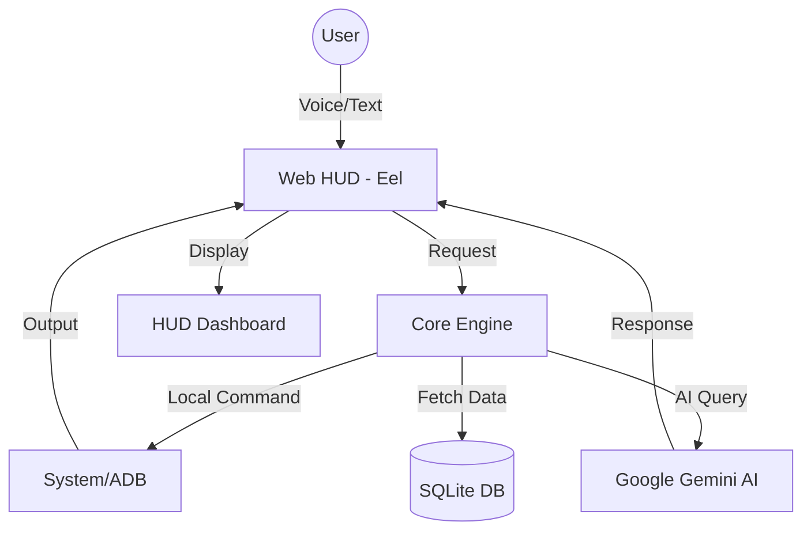

# <p align="center"> J.A.R.V.I.S — Artificial Intelligence </p>

<p align="center">
  
  
  
  
</p>

<p align="center">
  <b>An Advanced Virtual Assistant with a sleek Iron Man-inspired HUD, Multilingual support, and Hybrid Intelligence.</b>
</p>

---

## 🌌 Introduction

Welcome back, Sir. **J.A.R.V.I.S** (Just A Rather Very Intelligent System) is not just a voice assistant; it's a desktop shell built for speed, security, and aesthetics. Designed with an Iron Man style HUD, it combines local system automation with the reasoning power of **Google Gemini AI**.

### ✨ Highlights
- **🎭 Stunning UI:** A futuristic HUD with Arc Reactor animations, particle effects, and live system monitoring.
- **🧠 Hybrid Brain:** Switches between local commands (fast) and Gemini AI (smart).
- **🗣️ Polylingual:** Fluently speaks and understands English, Hindi, and Bengali.
- **🔒 Secure Vault:** Keeps your API keys encrypted and safe from prying eyes.

---

## 🛠️ Architecture



---

## 🚀 Key Features

### 🖥️ Desktop Command Center
- **Smart Launching:** Opens any app or website with fuzzy matching.
- **Window Switching:** Automatically focuses on already open instances.
- **System Monitoring:** Live RAM, CPU usage, and network activity on your dashboard.

### 📱 Android Integration (ADB)
- Make phone calls directly from your PC.
- Send SMS messages using voice commands.
- Advanced automation via ADB triggers.

### 💬 Intelligent Communications
- **WhatsApp Integration:** Send messages and start video calls using voice.
- **Email/Browser:** Seamlessly navigate the web and manage tasks.

### ⚡ Smart Automation
- **Hotword Detection:** Listens for "Jarvis" or "Alexa" to wake up.
- **YouTube Playback:** Plays music or videos instantly.
- **System Controls:** Shutdown, Restart, or Lock your PC via voice.

---

## 🎨 Interface Preview

<div align="center">
    
    <br>
    <i>Futuristic Iron Man HUD with Dynamic Animations</i>
</div>

---

## ⚙️ Installation

### 1. Prerequisites
- **Python 3.8+**
- **Google Chrome** (for Eel app mode)
- **ADB** (optional, for Android features)

### 2. Setup
Clone the repository and install dependencies:
```bash
git clone https://github.com/TusarGoswami/jarvis-main.git
cd jarvis-main
pip install -r requirements.txt
```

### 3. API Configuration
J.A.R.V.I.S uses an encrypted vault for security.
1. Run `python setup_encryption.py` to initialize your secure vault.
2. Edit `engine/config.py` (or use the vault command) to add your **Gemini API Key**.

---

## 🚦 Usage

Launch the system:
```bash
python run.py
```

### 🗣️ Example Commands
- *"Hey Jarvis, open YouTube and play Iron Man trailer"*
- *"Jarvis, message Mom on WhatsApp saying 'I'll be home late'"*
- *"Sir, what is the current CPU usage?"*
- *"J.A.R.V.I.S, open ChatGPT"*

---

## 🛠️ Built With

- **Backend:** [Python](https://www.python.org/)
- **Frontend:** [HTML5](https://developer.mozilla.org/en-US/docs/Web/HTML), [CSS3](https://developer.mozilla.org/en-US/docs/Web/CSS), [JavaScript](https://developer.mozilla.org/en-US/docs/Web/JavaScript)
- **Interface:** [Eel](https://github.com/python-eel/Eel)
- **AI Engine:** [Google Gemini API](https://ai.google.dev/)
- **Database:** [SQLite](https://www.sqlite.org/)
- **Animations:** [SiriWave](https://github.com/kopiro/siriwave), [Particles.js](https://vincentgarreau.com/particles.js/)

---

## 🤝 Contributing

Contributions are what make the open source community such an amazing place to learn, inspire, and create. Any contributions you make are **greatly appreciated**.

1. Fork the Project
2. Create your Feature Branch (`git checkout -b feature/AmazingFeature`)
3. Commit your Changes (`git commit -m 'Add some AmazingFeature'`)
4. Push to the Branch (`git push origin feature/AmazingFeature`)
5. Open a Pull Request

---

## 👨‍💻 Author

**Tusar Goswami**
- GitHub: [@TusarGoswami](https://github.com/TusarGoswami)
- Passionate about AI and Futuristic UI.

---

<p align="center">Made with ❤️ and a lot of ☕ by Tusar</p>
